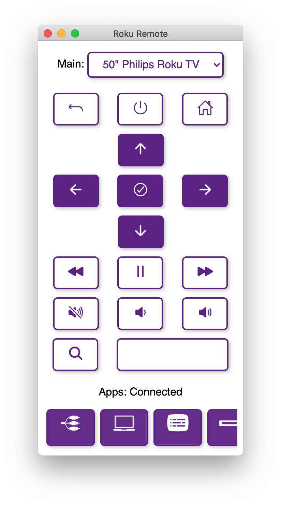

# Roku Remote: 

This project is a simple experiment for having a TV remote app to control your Roku TV. This desktop application is built with electron and is cross-platform on MacOS, Windows, and Linux.

## How to use:

### Basic Usage:

Begin by launching the terminal and moving the path to this folder. Make sure that you have [Node JS](https://nodejs.org/en) installed.

If you would like to use this project you need to download the packages with `npm install` and then you can launch the app with the command `npm run start`.

### Generating An App:

If you want to package the application yourself to have it run on your OS you can run the following command.

```
npm run make
```

The command will generate a packaged executable with all the code from this app.

*WARNING: This has been tested multiple times on macOS but hasn't been tested on Windows so there might be inconsistencies*

## How it works:

### General:

The way the application works is by scanning all devices connected to your local network and identifying which one is a Roku TV using the API. 

Once it has found all the TVs connected to your local network it will load up the first TV it found and allow you to control it from the remote.

### Actions:

The buttons are all sending push requests to the TV based on the IP address and the command.

For the applications, it extracts the application data from the TV and then provides all the different applications available.

### Trouble Shooting:

If the application is unable to find the TV then the application will inform the user that no TVs were found.

If you are sure that there is a TV connected to the network, then you can reload the application and open up the developer tools, and in the console, it will show all the different IP addresses that were scanned.

## Using The Code:

The bulk of the application is stored in `renderer.js` where it has the object `RokuRemote` that has access to all the different functions and variables that make the application work.

### node-roku:

The package `node-roku` allows the application to more simply find the television by using the function `Roku.find( (err, devices) => { /* code */ })` that allows the data to be properly extracted.

To get all the applications from the TV we can again use the `node-roku` API and use the function `Roku.getApps(address, (err, details) => { /* code */ });`

#### Modifications:

I tweaked the package a little bit by having it scan more devices quickly and having it respond instantly when a television is found rather than waiting for the end of the system. 

*NOTE: these changes make the callback in the `Roku.find` function be called more than once (the first time a TV is found, and then again after all the TVs are found)*

### The Application:

As previously stated, the entire code takes place in the `RokuRemote` object with different methods and variables that allow the application to work.

If you want to run a command like a button being pressed on the remote you can write the following line of code:
```javascript
RokuRemote.runButton("home");
```

For more commands, you can go to the [Roku Developer Website](https://developer.roku.com/docs/developer-program/dev-tools/external-control-api.md) to find different functions.

There are also keybinds that are stored in the object `RokuRemote.keyEndpoint`. It's a hashtable that has the key as the letter on the keyboard and the value as the command. 
* Example: `RokuRemote.keyEndpoint.H = "home";`

The IP addresses of the TVs are all stored in the array `RokuRemote.addresses` and the one that is currently being used is stored in `RokuRemote.address`.

## Screenshots:



## Sources:

This project was built with the following frameworks:
- [Node JS](https://nodejs.org/en): The core developer tools of this application
- [ElectronJS](https://www.electronjs.org/): Foundation of the application
- [Electron Forge](https://www.electronforge.io/): Secondary development layer for Electron
- [Ionicons](https://ionic.io/ionicons): The icons used in the application
- [Roku Development Tools](https://developer.roku.com/docs/developer-program/dev-tools/external-control-api.md): The main communication tool between the application and the television
- [xml2json](https://github.com/henrikingo/xml2json ): A library to simplify getting the XML data from the TV into JSON
- [Node Roku](https://www.npmjs.com/package/node-roku): The application contains a modified version of the node roku package.
